# 🔐 AES Encryption — RTL Hardware Implementation

A complete **AES (Advanced Encryption Standard) hardware implementation using Verilog/SystemVerilog**, featuring a modular AES encryption core, configurable key expansion, FSM-based control, and five block cipher modes of operation.

The design supports **AES-128, AES-192, and AES-256**, with dedicated verification environments for the AES core, key expansion, and all implemented encryption modes.

---

## Project Overview

This project implements the **AES encryption algorithm at the RTL hardware level**.

The design uses a modular architecture in which the AES datapath, key expansion logic, control FSM, and state storage are implemented as separate RTL modules.

The AES core is then integrated into five block cipher modes:

- **ECB** — Electronic Codebook
- **CBC** — Cipher Block Chaining
- **CFB** — Cipher Feedback
- **OFB** — Output Feedback
- **CTR** — Counter

The implementation supports the three standard AES key sizes:

| AES Version | Key Size | Number of Rounds |
|-------------|----------|------------------|
| AES-128 | 128 bits | 10 |
| AES-192 | 192 bits | 12 |
| AES-256 | 256 bits | 14 |

The AES data block size is **128 bits**.

---

#  Key Features

- ✅ AES-128 encryption
- ✅ AES-192 encryption
- ✅ AES-256 encryption
- ✅ Configurable AES Key Expansion
- ✅ Modular AES datapath
- ✅ SubBytes
- ✅ ShiftRows
- ✅ MixColumns
- ✅ AddRoundKey
- ✅ Initial and final AES round handling
- ✅ FSM-based encryption control
- ✅ State Register
- ✅ Five encryption modes:
  - ECB
  - CBC
  - CFB
  - OFB
  - CTR
- ✅ Dedicated testbenches for AES core components
- ✅ Dedicated Key Expansion verification
- ✅ Verification across AES-128, AES-192, and AES-256
- ✅ Verification of all supported encryption modes
- ✅ ModelSim/QuestaSim simulation
- ✅ RTL linting
- ✅ Synthesis

---

#  Architecture

The design is divided into two main parts:

1. **AES Encryption Core**
2. **Encryption Mode Wrappers**

### AES Core

At the top level, plaintext and the encryption key are processed by the AES core. The control FSM sequences the encryption rounds, while the Key Expansion logic generates and selects the required round keys.

The core uses an **iterative architecture**, reusing the `AES_ROUND` datapath across encryption rounds rather than instantiating a separate round datapath for every round.

### Top-Level Flow
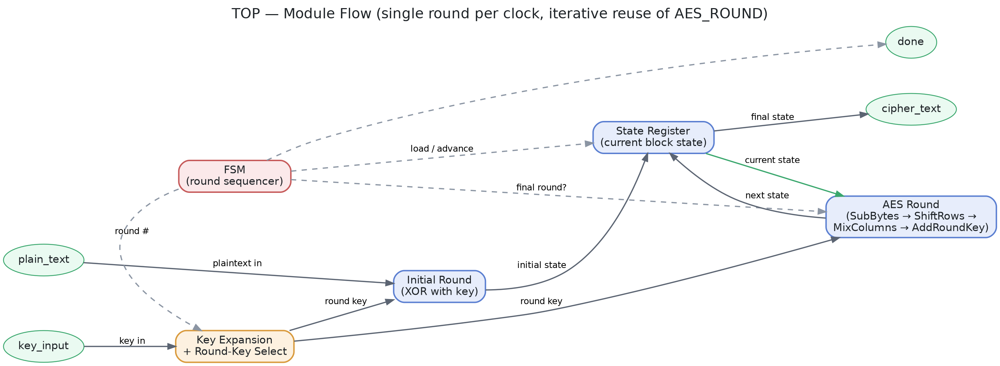
> **Architecture note:** The `AES_ROUND` module is iteratively reused across the encryption process, providing a resource-efficient round-based datapath.

### AES Round Datapath


For the **final AES round**, `MixColumns` is bypassed as required by the AES specification.

---

## Encryption Modes Architecture

The AES core is reused by the five implemented block cipher modes.

The repository contains dedicated top-level modules for each mode.

### Mode-Level RTL Flow

---

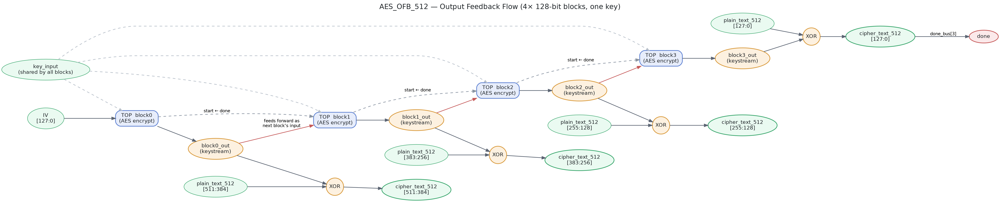
---

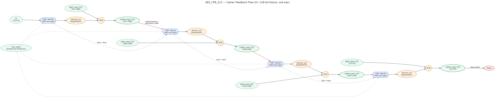
---

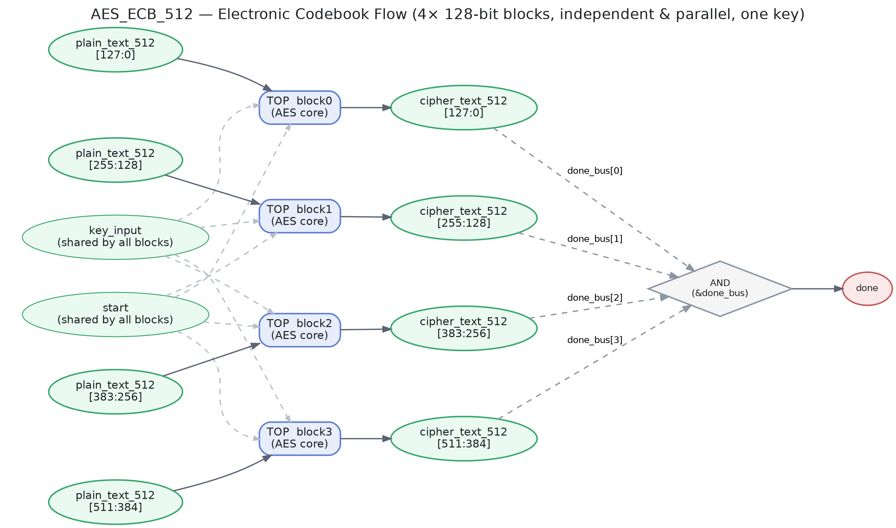
---

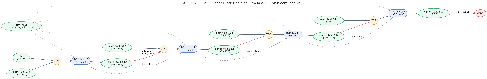
---

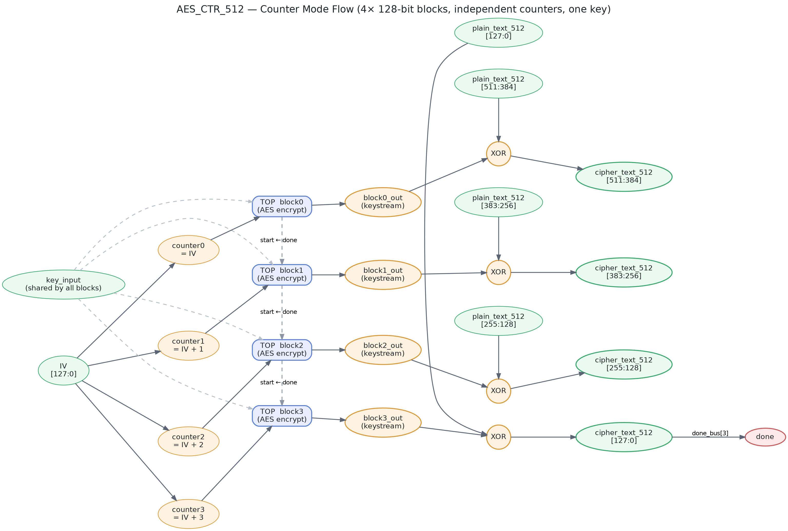


These diagrams illustrate the RTL data flow and feedback/counter mechanism used by each mode.

---

# AES Encryption Core

The main AES implementation is located in:

```text id="c0v3cm"
AES_Encryption/
```

The core is composed of several independent RTL modules.

### Main Modules

| Module | Function |
|--------|----------|
| `TOP.v` | Top-level AES encryption module |
| `AES_ROUND.v` | Implements an AES encryption round |
| `Initial_Round.v` | Implements the initial AddRoundKey operation |
| `SUBBYTES.sv` | AES SubBytes transformation |
| `SHIFTROWS.sv` | AES ShiftRows transformation |
| `MIXCOLUMNS.sv` | AES MixColumns transformation |
| `ADDROUNDKEY.v` | AES AddRoundKey transformation |
| `sbox.v` | AES S-Box |
| `state_register.v` | Stores the AES state between rounds |
| `fsm.v` | Controls the AES encryption sequence |
| `key_exp.v` | AES Key Expansion |
| `round_key.v` | Round-key generation and control |

---

# AES Encryption Process

The AES encryption datapath follows the standard AES transformation sequence.

For a normal AES round:
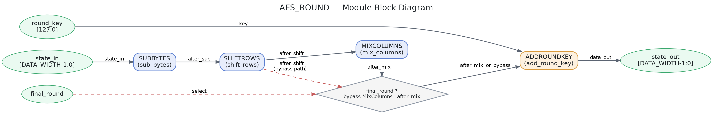

The **initial round** performs only:

```text id="1kqj0f"
AddRoundKey
```

The **final round** excludes `MixColumns`, according to the AES specification.

The control FSM determines the appropriate sequence of operations and coordinates the AES datapath with the generated round keys.

---

# Key Expansion

The project implements AES Key Expansion for all three standard key sizes:

```text id="6f2c4d"
AES-128
AES-192
AES-256
```

The configuration is controlled through:

```text id="x2g4m1"
config.vh
```

The corresponding parameters are:

| Configuration | `Nk` | `Nr` | Key Size |
|--------------|-----:|-----:|---------:|
| AES-128 | 4 | 10 | 128 bits |
| AES-192 | 6 | 12 | 192 bits |
| AES-256 | 8 | 14 | 256 bits |

The generated round keys were verified against the AES key expansion reference examples.

### Key Expansion Verification

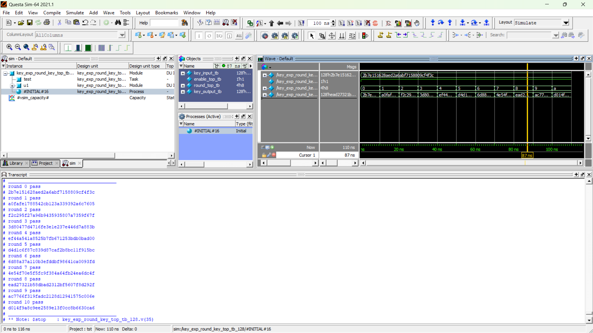
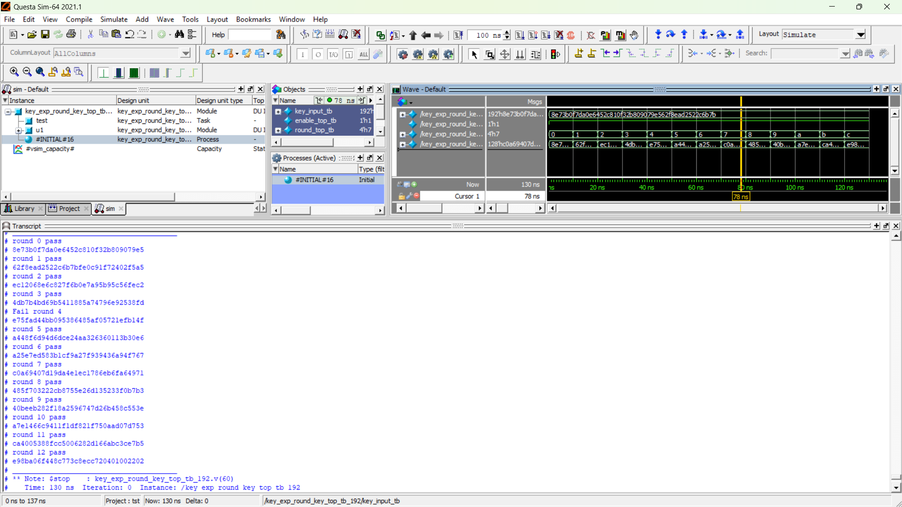
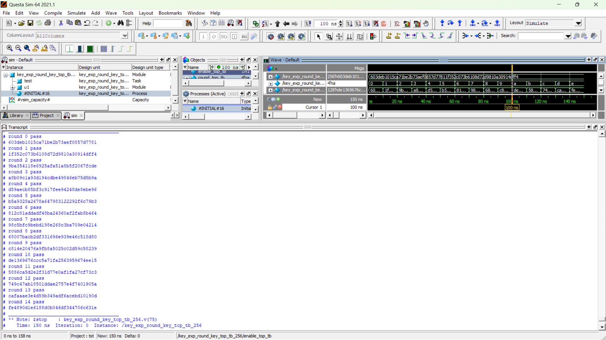


---

# Encryption Modes

The AES core is used to implement five block cipher modes of operation:

| Mode | Full Name |
|------|-----------|
| **ECB** | Electronic Codebook |
| **CBC** | Cipher Block Chaining |
| **CFB** | Cipher Feedback |
| **OFB** | Output Feedback |
| **CTR** | Counter |

The mode-level implementations are located in:

```text id="j8z4a2"
TOP_modules_for_each_encryption_mode/
```

### Implemented Modules

```text id="h7c1s0"
AES_ECB_512.v
AES_CBC_512.v
AES_CFB_512.v
AES_OFB_512.v
AES_CTR_512.v
```

Each mode has a dedicated testbench.

---

# Verification

Verification was performed at multiple levels, from individual AES components to the complete encryption modes.

The verification environment includes dedicated testbenches for:

- AES Key Expansion
- AES Round
- AES Top-Level
- ECB
- CBC
- CFB
- OFB
- CTR

The implemented AES core and encryption modes were tested using **AES-128, AES-192, and AES-256 configurations**.

---

# Verification Results

The following matrix summarizes the implemented verification coverage:

| Component / Mode | AES-128 | AES-192 | AES-256 |
|------------------|:-------:|:-------:|:-------:|
| Key Expansion | ✅ | ✅ | ✅ |
| ECB | ✅ | ✅ | ✅ |
| CBC | ✅ | ✅ | ✅ |
| CFB | ✅ | ✅ | ✅ |
| OFB | ✅ | ✅ | ✅ |
| CTR | ✅ | ✅ | ✅ |

> **Note:** Each mode-level testbench was executed for all three AES key sizes.

---

## AES Core Verification

### AES Round

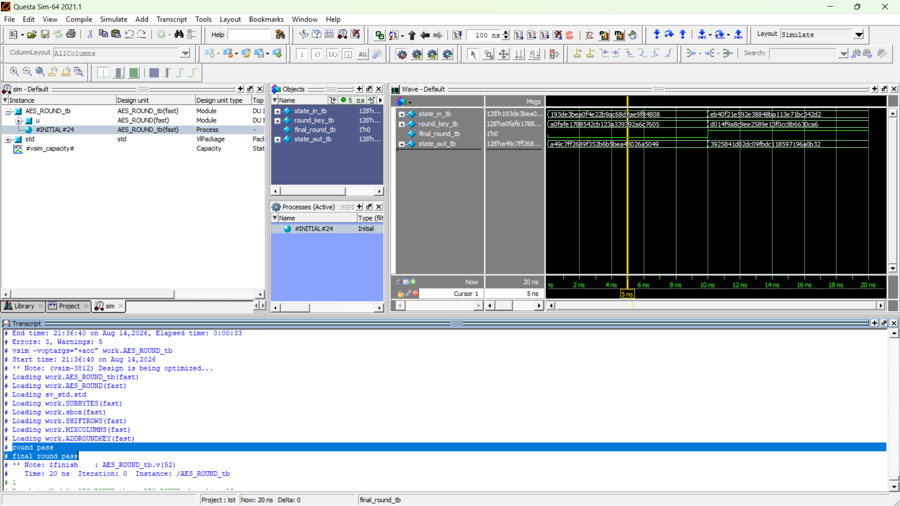


---

### AES Top-Level

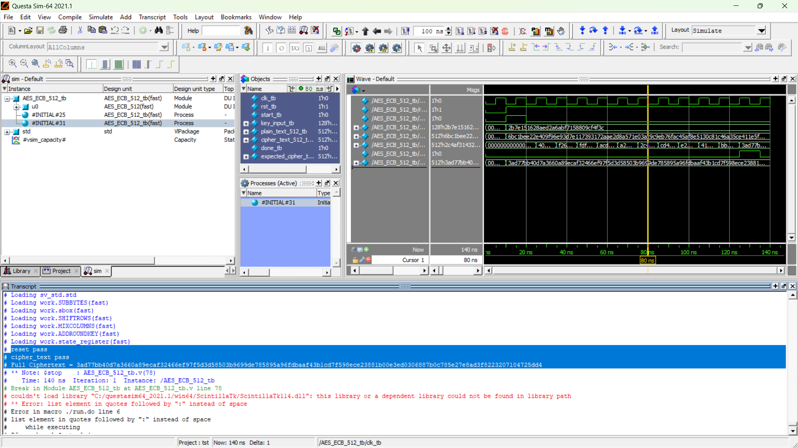


---

# Encryption Mode Verification

Each supported mode was verified independently using the AES core.

### ECB

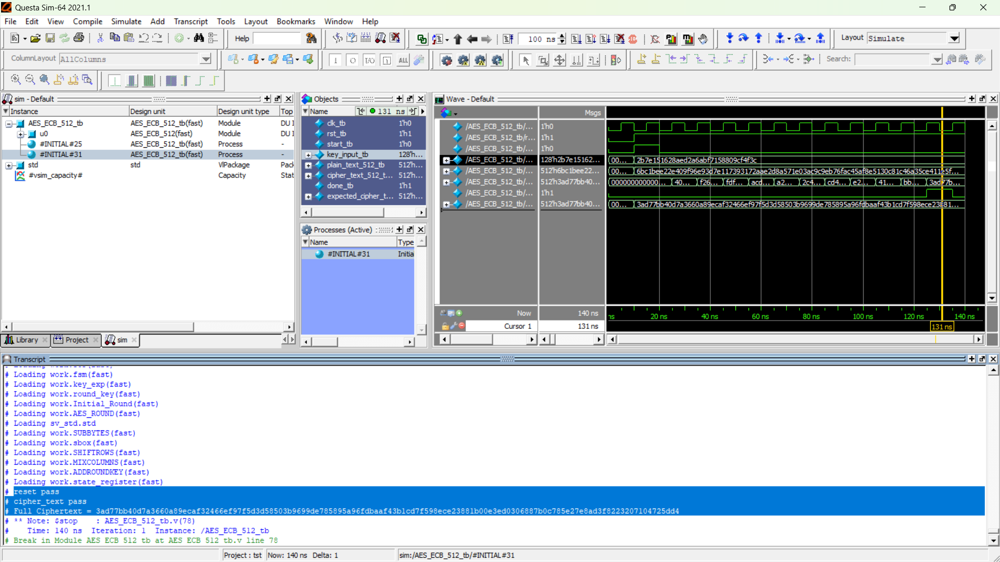 
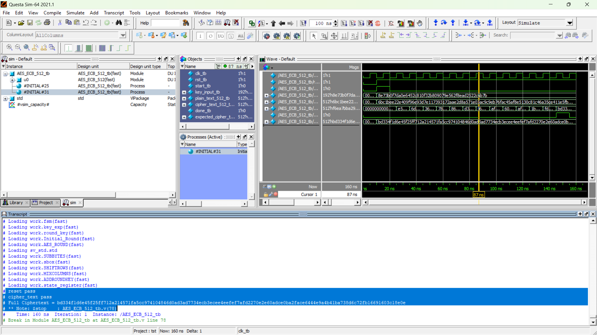 
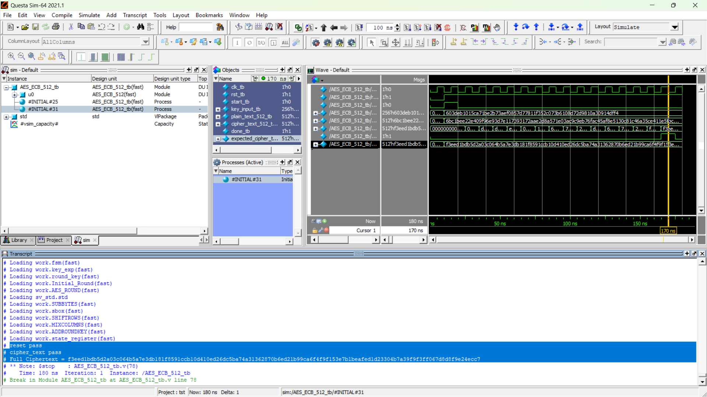 
`AES_ECB_512_tb.v`

The testbench verifies ECB operation for:

- AES-128
- AES-192
- AES-256

---

### CBC

 
 
 
`AES_CBC_512_tb.v`

The testbench verifies CBC operation for:

- AES-128
- AES-192
- AES-256

---

### CFB

 
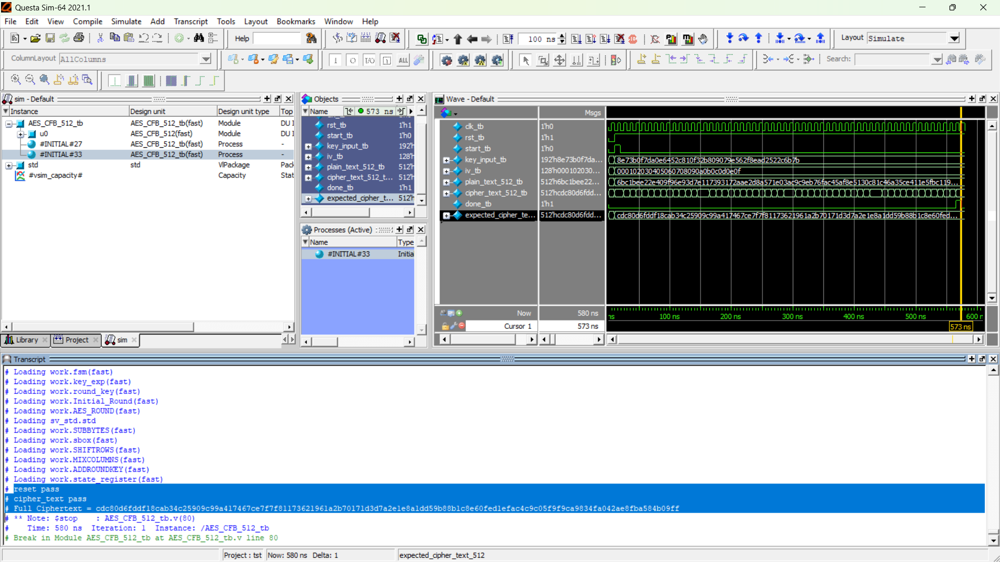 
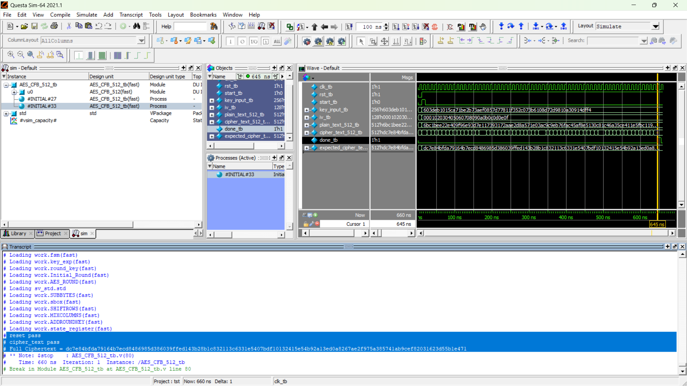
`AES_CFB_512_tb.v`

The testbench verifies CFB operation for:

- AES-128
- AES-192
- AES-256

---

### OFB

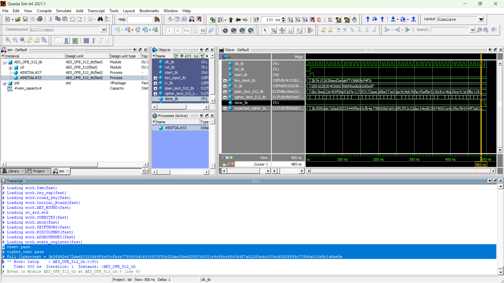 
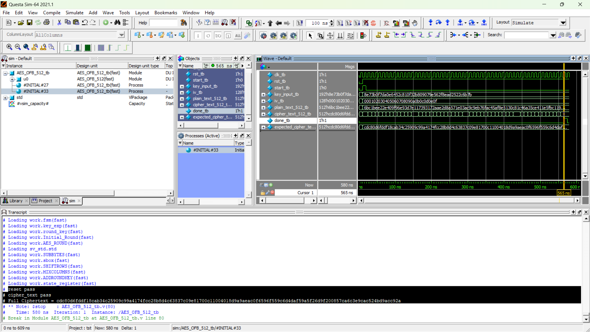 
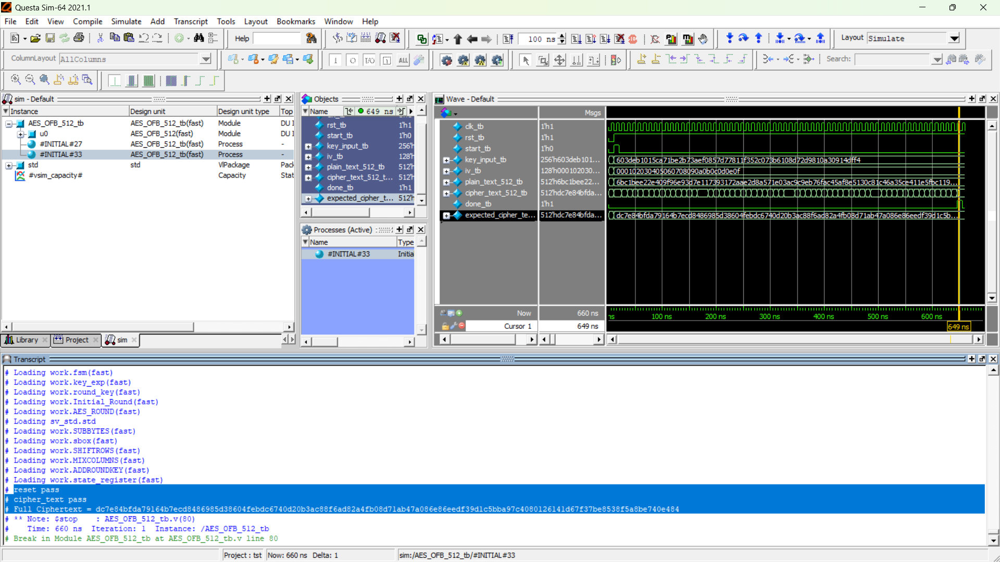
`AES_OFB_512_tb.v`

The testbench verifies OFB operation for:

- AES-128
- AES-192
- AES-256

---

### CTR

 
 

`AES_CTR_512_tb.v`

The testbench verifies CTR operation for:

- AES-128
- AES-192
- AES-256

---

# Repository Structure

```text id="5myq8e"
-AES_Encryption/
│
├── AES_Encryption/
│   ├── ADDROUNDKEY.v
│   ├── AES_ROUND.v
│   ├── Initial_Round.v
│   ├── MIXCOLUMNS.sv
│   ├── SHIFTROWS.sv
│   ├── SUBBYTES.sv
│   ├── TOP.v
│   ├── fsm.v
│   ├── key_exp.v
│   ├── round_key.v
│   ├── sbox.v
│   └── state_register.v
│
├── TOP_modules_for_each_encryption_mode/
│   ├── AES_CBC_512.v
│   ├── AES_CFB_512.v
│   ├── AES_CTR_512.v
│   ├── AES_ECB_512.v
│   └── AES_OFB_512.v
│
├── TB_for_sub_modules/
│   ├── AES_ROUND_tb.v
│   ├── MIXCOLUMNS_tb.v
│   ├── SHIFTROWS_tb.v
│   ├── TOP_tb.v
│   ├── fsm_tb.v
│   ├── key_exp_round_key_fsm_top.v
│   ├── key_exp_round_key_fsm_top_tb.v
│   ├── key_exp_round_key_top.v
│   ├── key_exp_round_key_top_tb_128.v
│   ├── key_exp_round_key_top_tb_192.v
│   └── key_exp_round_key_top_tb_256.v
│
├── TB_for_encryption_modes/
│   ├── AES_CBC_512_tb.v
│   ├── AES_CFB_512_tb.v
│   ├── AES_CTR_512_tb.v
│   ├── AES_ECB_512_tb.v
│   └── AES_OFB_512_tb.v
│
├── LINT/
├── config.vh
├── run.do
└── README.md
```

---

# Configuration

The AES configuration is controlled through:

```text id="0f3k2n"
config.vh
```

The design can be configured for:

```verilog id="q9w4k1"
// AES-128
`define AES_128

// AES-192
`define AES_192

// AES-256
`define AES_256
```

Only the required AES configuration should be enabled at a time.

The configuration controls the key size and the number of AES rounds.

---


# References
NIST FIPS 197: Advanced Encryption Standard (AES)

https://csrc.nist.gov/pubs/fips/197/final

NIST SP 800-38A: Recommendation for Block Cipher Modes of Operation

https://csrc.nist.gov/pubs/sp/800/38/a/final


### Project Repository

The complete RTL implementation, testbenches, configuration files, linting files, and simulation scripts are available in this repository:

**[AES Encryption — GitHub Repository](https://github.com/eltaweel1/-AES_Encryption)**

---


# 👨‍💻 Author

**Abdelrahman Moamen Eltaweel**

Electronics & Communications Engineering Student  
Cairo University